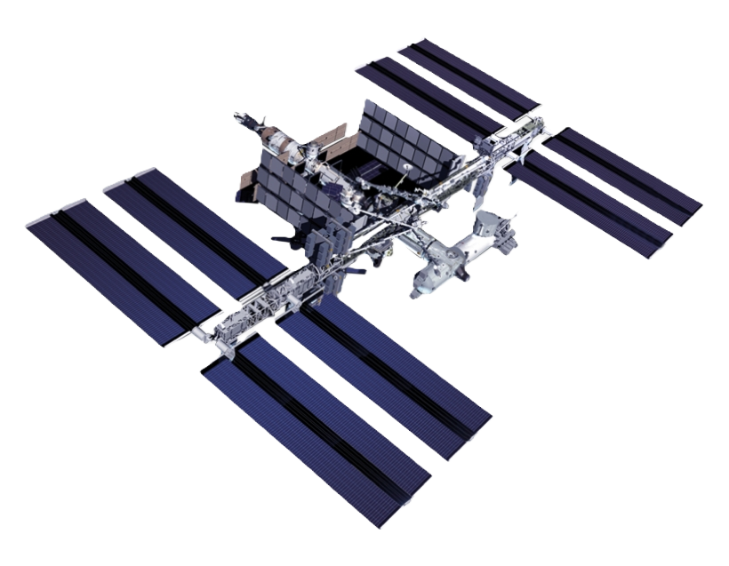

# ISS Tracker

This project is a simple web application that tracks the real-time location of the International Space Station (ISS) using the `wheretheiss.at` API. The location is displayed on a map using the Leaflet.js library.

## Features

- Real-time ISS location tracking.
- Dynamic map that updates every 2 seconds to reflect the current position of the ISS.
- Displays the current latitude and longitude of the ISS.

## Technologies Used

- **HTML/CSS**: For structuring and styling the webpage.
- **JavaScript**: For fetching data from the API and updating the map.
- **Leaflet.js**: A JavaScript library used to display the map and the ISS icon on it.
- **API**: [`wheretheiss.at`](https://wheretheiss.at) API for fetching the current location of the ISS.

## Project Structure

- `index.html`: The main HTML file that contains the structure of the webpage.
- `app.js`: The JavaScript file that handles the logic for fetching the ISS location and updating the map.
- `ISS.png`: The icon used for representing the ISS on the map.

## How It Works

1. **Map Initialization**: 
   - The map is initialized using the Leaflet.js library and centered at coordinates `[0, 0]` with a zoom level of 1.

2. **Marker and Icon**:
   - A custom icon (`ISS.png`) is used to represent the ISS on the map.
   - A marker is placed on the map at the initial coordinates `[0, 0]`.

3. **API Call**:
   - The application fetches the current latitude and longitude of the ISS from the `wheretheiss.at` API.

4. **Updating the Map**:
   - The marker's position on the map is updated every 2 seconds with the new coordinates from the API.
   - The latitude and longitude values are also displayed on the webpage.

## How to Run

1. Clone the repository or download the project files.
2. Make sure all files are in the same directory.
3. Open `index.html` in your web browser.
4. The webpage will load and start displaying the real-time location of the ISS on the map.

## Screenshot

## Dependencies

- [Leaflet.js](https://leafletjs.com/) (Included via CDN)

## Credits

- ISS data provided by [`wheretheiss.at`](https://wheretheiss.at)
- Map tiles by [OpenStreetMap](https://www.openstreetmap.org/)
